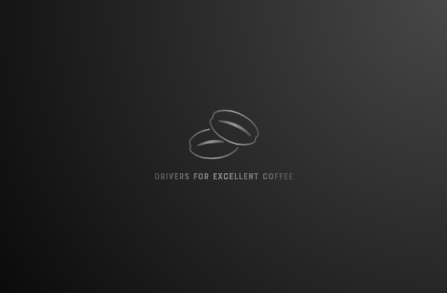

### Project Summary

#### Project Objectives
> - Document code, process (data acquistion, preparation, exploratory data analysis and statistical testing, modeling, and model evaluation), findings, and key takeaways in a Jupyter Notebook report.
> - Create modules (acquire.py, wrangle.py, functions.py, prepare.py) that make your process repeateable.
> - Construct a model to predict weither or not a coffee will recieve a rating of 8.4 or higher using classification techniques.
> - Deliver a high-level notebook walkthrough using your Jupyter Notebook from above;

#### Project Goals
> - The goal of this project is to find and document drivers for arabica coffee who have been graded 84 or higher using a machine learning classification model.
> - Document your process well enough to be read like a report.

#### Audience
> - Codeup data science students, coffee enthusiasts, and the world

#### Project Deliverables
> - A final report notebook 
> - All necessary modules to make my project reproducible

#### Project Context
> - The original data is from coffee quality institute database [cqi](https://www.coffeeinstitute.org) but I downloaded the csv file from the kaggle link [here](https://www.kaggle.com/volpatto/coffee-quality-database-from-cqi/)

#### Data Dictionary

| Feature               | Datatype               | Description                                 |
|:----------------------|:-----------------------|:--------------------------------------------|
| Unnamed: 0            | 1311 non-null: int64   | index column                                |
| Species               | 1311 non-null: object  | Species of coffee bean (arabica or robusta) |
| Owner                 | 1304 non-null: object  | Owner of the farm                           |
| Country.of.Origin     | 1310 non-null: object  | Where the bean came from                    |
| Farm.Name             | 955 non-null: object   | Name of the farm                            |
| Lot.Number            | 270 non-null: object   | Lot number of the beans tested              |
| Mill                  | 1001 non-null: object  | Mill where the beans were processed         |
| ICO.Number            | 1165 non-null: object  | International Coffee Organization number    |
| Company               | 1102 non-null: object  | Company name                                |
| Altitude              | 1088 non-null: object  | Altitude                                    |
| Region                | 1254 non-null: object  | Region where bean came from                 |
| Producer              | 1081 non-null: object  | Producer of the roasted bean                |
| Number.of.Bags        | 1311 non-null: int64   | Number of bags tested                       |
| Bag.Weight            | 1311 non-null: object  | Bag weight tested                           |
| In.Country.Partner    | 1311 non-null: object  | Partner for the country                     |
| Harvest.Year          | 1264 non-null: object  | When the beans were harvested (year)        |
| Grading.Date          | 1311 non-null: object  | When the beans were graded                  |
| Owner.1               | 1304 non-null: object  | Who owns the beans                          |
| Variety               | 1110 non-null: object  | Variety of the beans                        |
| Processing.Method     | 1159 non-null: object  | character Method for processing             |
| Aroma                 | 1311 non-null: float64 | Aroma grade                                 |
| Flavor                | 1311 non-null: float64 | Flavor grade                                |
| Aftertaste            | 1311 non-null: float64 | Aftertaste grade                            |
| Acidity               | 1311 non-null: float64 | Acidity grade                               |
| Body                  | 1311 non-null: float64 | Body grade                                  |
| Balance               | 1311 non-null: float64 | Balance grade                               |
| Uniformity            | 1311 non-null: float64 | Uniformity grade                            |
| Clean.Cup             | 1311 non-null: float64 | Clean cup grade                             |
| Sweetness             | 1311 non-null: float64 | Sweetness grade                             |
| Cupper.Points         | 1311 non-null: float64 | Cupper Points                               |
| Total.Cup.Points      | 1311 non-null: float64 | Total rating/points (0 - 100 scale)         |
| Moisture              | 1311 non-null: float64 | Moisture Grade                              |
| Category.One.Defects  | 1311 non-null: int64   | Category one defects (count)                |
| Quakers               | 1310 non-null: float64 | quakers                                     |
| Color                 | 1095 non-null: object  | Color of bean                               |
| Category.Two.Defects  | 1311 non-null: int64   | Category two defects (count)                |
| Expiration            | 1311 non-null: object  | Expiration date of the beans                |
| Certification.Body    | 1311 non-null: object  | Who certified it                            |
| Certification.Address | 1311 non-null: object  | Certification body address                  |
| Certification.Contact | 1311 non-null: object  | Certification contact                       |
| unit_of_measurement   | 1311 non-null: object  | Unit of measurement                         |
| altitude_low_meters   | 1084 non-null: float64 | Altitude low meters                         |
| altitude_high_meters  | 1084 non-null: float64 | Altitude high meters                        |
| altitude_mean_meters  | 1084 non-null: float64 | Altitude mean meters                        |

| Engineered Features   | From                        | Description                                 |
|:----------------------|:----------------------------|:--------------------------------------------|
| grading_month         | Grading.Date                | Integar Values ranging from 1 - 12          |
| grading_year          | Grading.Date                | Integar Values ranging from 2010-2017       |
| grading_day           | Grading.Date                | Integar Values ranging from 1-31            |
| excellent_rating      | Total.Cup.Points >= 84      | Integar Values: 1 for True; 0 for False     |
| total_bag_weight      | Number.of.Bags * Bag.Weight | Float measured in kilograms                 |

#### Original Hypotheses

> - The altitude_mean_meters and the processing_method are the two most important drivers for coffee rating of 84 or higher

#### Hypothesis 1
> - alpha = .05
> - $H_0$: There is no difference in altitude_mean_meters in 84 or higher rated coffee from less than 84 rated coffee.
> - $H_a$: There is a difference in altitude_mean_meters in 84 or higher rated coffee from less than 84 rated coffee.
> - Outcome: I rejected null hypothesis; There IS a difference in altitude_mean_meters in 84 or higher rated coffee from less than 84 rated coffee.

#### Hypothesis 2
> - alpha = .05
> - $H_0$: The average bag_weight of 84 or higher rated coffee is not different than the average of the entire population.
> - $H_a$: The average bag_weight of 84 or higher rated coffee is different than the average of the entire population.
> - Outcome: I rejected null hypothesis; The average bag_weight of 84 or higher rated coffee IS different than the average of the entire population.

### Executive Summary - Conclusions & Next Steps

#### Conclustion

> - My random forest classifier model accuracy for unseen data (test) was 85% beating my baseline accuracy.
> - My model confirmed that only half of my original hypothesis was correct. Alttitude was a driver but processing_method was not.
> - My model identified the most important features as: altitude_mean_meters, grading_month, number_of_bags, harvest_year, & bag_weight.
> - If I had more time I would have liked to: web scraped for newer coffee data, engineer more features, find out the average temperature for each region, iterate through hyperparameters to boost accuracy, & have more domain knowledge.

#### Recommendations

> - The data suggests for anyone trying to pursue coffee grades of 84 or higher to; use a farm located in a high altitude area, have your coffee ready for grading by December, have a large harvest, & use heavier bags of coffee.
> - These are interesting suggestions as I don't have enough domain knowledge to know why having a large havest & heavier bags would make a difference in grading score. I would speculate that the larger the harvest the more it would overshadow any bad coffee bean plants but im not 100% certain.  Whereas, the altitude and grading_month recommendations make more sense.  

#### Key Takeaways
> - After the preperation, the data only had 132 coffees, rated 84 or higher, out of the 838 total observations.  The data was dated between the years 2010-2017.  None of the features like Aroma, Body, Cupper.Points, etc.. were used in the modeling since they are too directly correlated with the score.  Only arabica coffee observations were used.

### Pipeline Stages Breakdown

##### Plan

> - Setup my environment, create a new repository, update the .gitignore, create a README.md with the data dictionary, project goals, and come up with an original hypothesis.
> - Acquire the data from kaggle
> - Clean the data, drop any useless features, remove duplicate observations, double check data-types, find any null values, decide what do with null values, and encode the features.
> - Split the Data, into three data sets named train, validate, and test.=  
> - Explore the data, look through the graphs and evaluate each feature to see if they play a part in churn.  Exploration will also include two hypotheses, setting of alpha, statistical tests, rejecting or failing to reject the null hypothesis, and documentation of the findings and takeaways. 
> - Create Models, create three machine learning models plus a baseline model.  Will be using a DecisionTreeClassifier, RandomForestClassifier, and KNeighborsClassifier.  Evaluate models on train and validate datasets.  Pick the model with highest validate accuracy to run on my final test data.
> - Wrap it up, document conclusions, recommendations, and take aways in the final report notebook
___

##### Plan -> Acquire
> - Visit Kaggle and download a copy of the csv it is named arabica_data_cleaned.csv
> - The final function will return a pandas DataFrame.
> - Import the acquire function from the acquire.py module
> - Complete some initial data summarization (`.info()`, `.describe()`, `.head()`, ...).
> - Plot distributions of individual variables.
___

##### Plan -> Acquire -> Prepare
> - Store functions needed to prepare arabica coffee data; The module contains the necessary imports to run the code. The final function should do the following:
    - Split the data into train/validate/test.
    - Handle any missing values.
    - Handle erroneous data and/or outliers that need addressing.
    - Encode variables as needed.
    - Create any new features, if made for this project.
> - Import the prepare function from the prepare.py module and use it to prepare the data in the Final Report Notebook.
___

##### Plan -> Acquire -> Prepare -> Explore
> - Answer key questions, my hypotheses, and figure out the features that can be used in a classification model to best predict the target variable, excellent_rating. 
> - Run at least 2 statistical tests in data exploration. Document my hypotheses, set an alpha before running the tests, and document the findings well.
> - Create visualizations and run statistical tests that work toward discovering variable relationships (independent with independent and independent with dependent). The goal is to identify features that are related to excellent_rating (the target), identify any data integrity issues, and understand 'how the data works'. If there appears to be some sort of interaction or correlation, assume there is no causal relationship and brainstorm (and document) ideas on reasons there could be correlation.
> - Summarize my conclusions, provide clear answers to my specific questions, and summarize any takeaways/action plan from the work above.
___

##### Plan -> Acquire -> Prepare -> Explore -> Model
> - Establish a baseline accuracy to determine if having a model is better than no model and train and compare at least 3 different models. Document these steps well.
> - Train (fit, transform, evaluate) multiple models, varying the algorithm and/or hyperparameters you use.
> - Compare evaluation metrics across all the models you train and select the ones you want to evaluate using your validate dataframe.
> - Based on the evaluation of the models using the train and validate datasets, choose the best model to try with the test data, once.
> - Test the final model on the out-of-sample data (the testing dataset), summarize the performance, interpret and document the results.
___

##### Plan -> Acquire -> Prepare -> Explore -> Model -> Deliver
> - A final report notebook 
> - All necessary modules to make my project reproducible

### Reproduce My Project

You will need to download your own csv file along with all the necessary files listed below to run my final project notebook. 
- [x] Read this README.md
- [ ] Download the aquire.py, prepare.py, functions.py, wrangle.py, and final.ipynb files into your working directory
- [ ] download csv from this [link](https://www.kaggle.com/volpatto/coffee-quality-database-from-cqi/download). The link will download a folder named archive, grab the csv file named arabica_data_cleaned.csv from within the archive folder and place it in your cloned repository and/or working directory. 
- [ ] Run the final_report.ipynb notebook